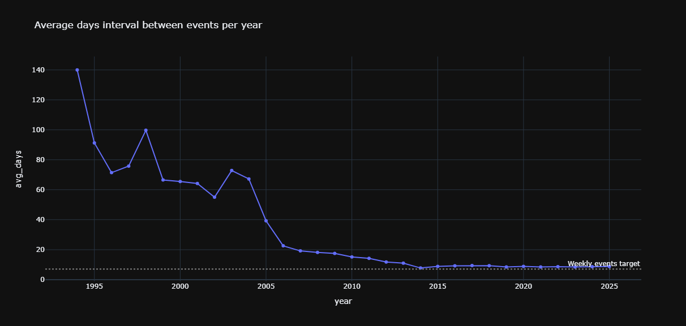
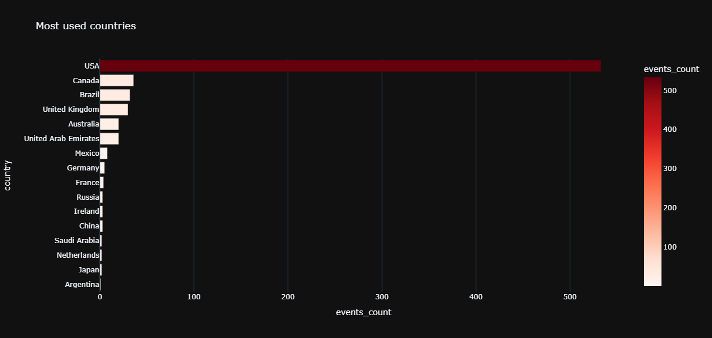
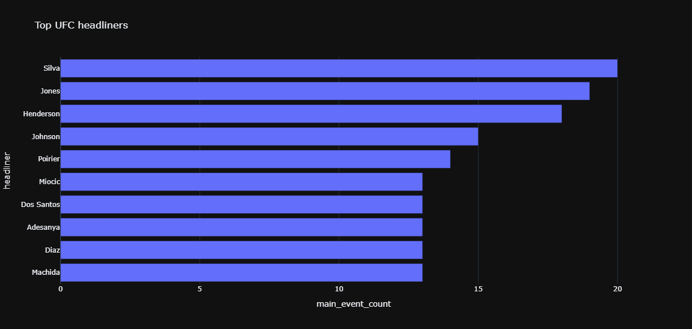

# 🥊 UFC Data Analytics & Visualization

A comprehensive tool for in-depth UFC data analysis. This project collects statistics, processes them through PostgreSQL, and builds interactive charts showcasing the evolution of the promotion from 1994 to the present day.

## 🚀 Key Features
- **Headliner Analysis:** Identify who has headlined the most events in a specific year or throughout the promotion's entire history.
- **Growth Dynamics:** Visualize the frequency of events (from 180 days between fights to weekly shows).
- **Tournament Geography:** Statistics on the most popular venues and countries.
- **Seasonality:** Analysis of promotional activity by month.

## 🛠 Technology Stack
- **Python 3.12+**
- **PostgreSQL** (data storage and complex aggregation)
- **SQLAlchemy** (database interaction)
- **Plotly** (interactive visualizations)
- **Pandas** (dataframe processing)

## 📦 How to Run
1. Clone the repository:
   ```bash
   git clone https://github.com
2. Run using Docker:
    ```bash 
    docker-compose up --build -d

## 📊 A few examples of graphs:

### 🗓 The average interval between events in each year:


### 📍 The most frequently used countries for events:


### 📈 The most frequent headliners of events:
